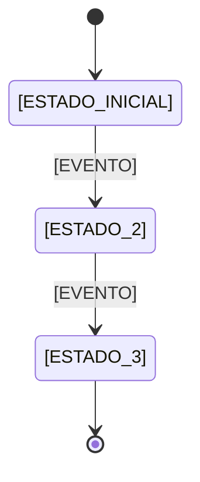

# Regras de Negocio - [NOME_DO_PROJETO]

> Este documento define as regras de negocio que governam o comportamento do sistema.

---

## 1. [DOMINIO_1]

### Regra 1.1: [NOME_DA_REGRA]

**Descricao:** [DESCRICAO_DA_REGRA]

**Condicao:** [QUANDO_A_REGRA_SE_APLICA]

**Acao:** [O_QUE_ACONTECE]

**Exemplo:**
```
[EXEMPLO_DA_REGRA_EM_ACAO]
```

### Regra 1.2: [NOME_DA_REGRA]

**Descricao:** [DESCRICAO_DA_REGRA]

**Condicao:** [QUANDO_A_REGRA_SE_APLICA]

**Acao:** [O_QUE_ACONTECE]

---

## 2. [DOMINIO_2]

### Regra 2.1: [NOME_DA_REGRA]

**Descricao:** [DESCRICAO_DA_REGRA]

**Condicao:** [QUANDO_A_REGRA_SE_APLICA]

**Acao:** [O_QUE_ACONTECE]

---

## 3. Validacoes

> Liste as validacoes obrigatorias do sistema.

| Campo | Regra | Mensagem de Erro |
|-------|-------|------------------|
| [CAMPO_1] | [REGRA_VALIDACAO] | [MENSAGEM] |
| [CAMPO_2] | [REGRA_VALIDACAO] | [MENSAGEM] |
| [CAMPO_3] | [REGRA_VALIDACAO] | [MENSAGEM] |

---

## 4. Permissoes e Autorizacao

| Acao | Roles Permitidos | Condicao |
|------|------------------|----------|
| [ACAO_1] | [ROLES] | [CONDICAO] |
| [ACAO_2] | [ROLES] | [CONDICAO] |
| [ACAO_3] | [ROLES] | [CONDICAO] |

---

## 5. Workflows e Estados

### [ENTIDADE_1] - Maquina de Estados



| Transicao | De | Para | Condicao | Acao |
|-----------|-----|------|----------|------|
| [TRANSICAO_1] | [ESTADO_A] | [ESTADO_B] | [CONDICAO] | [ACAO] |
| [TRANSICAO_2] | [ESTADO_B] | [ESTADO_C] | [CONDICAO] | [ACAO] |

---

## 6. Integridade de Dados

1. **[REGRA_INTEGRIDADE_1]:** [DESCRICAO]
2. **[REGRA_INTEGRIDADE_2]:** [DESCRICAO]
3. **[REGRA_INTEGRIDADE_3]:** [DESCRICAO]

---

## 7. Excecoes e Casos Especiais

| Caso | Comportamento Esperado | Justificativa |
|------|------------------------|---------------|
| [CASO_1] | [COMPORTAMENTO] | [JUSTIFICATIVA] |
| [CASO_2] | [COMPORTAMENTO] | [JUSTIFICATIVA] |

---

## Referencias

- [01-product-prd.md](./01-product-prd.md) - Contexto de produto
- [03-data-model.md](./03-data-model.md) - Modelo de dados
- [05-dictionary.md](./05-dictionary.md) - Definicao de termos
