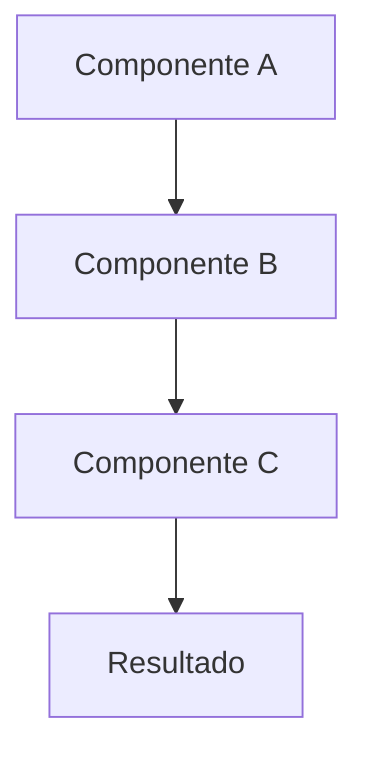

# Especificacoes Tecnicas - [NOME_DO_PROJETO]

> Este documento contem especificacoes tecnicas detalhadas para features complexas.

---

## 1. [FEATURE/SISTEMA_1]

### Visao Geral

**Proposito:** [DESCRICAO_DO_PROPOSITO]

**Status:** [IMPLEMENTADO/EM_DESENVOLVIMENTO/PLANEJADO]

### Arquitetura



### Especificacao Tecnica

#### Propriedades

| Propriedade | Tipo | Descricao |
|-------------|------|-----------|
| `[prop_1]` | [tipo] | [descricao] |
| `[prop_2]` | [tipo] | [descricao] |

#### Comportamento

1. **[CENARIO_1]:**
   - Input: [INPUT]
   - Processamento: [PROCESSAMENTO]
   - Output: [OUTPUT]

2. **[CENARIO_2]:**
   - Input: [INPUT]
   - Processamento: [PROCESSAMENTO]
   - Output: [OUTPUT]

#### Codigo de Referencia

```typescript
// Exemplo de implementacao
interface [Interface] {
  [campo_1]: [tipo];
  [campo_2]: [tipo];
}

function [funcao]([param]: [tipo]): [retorno] {
  // [descricao_logica]
}
```

### Constantes e Configuracoes

```typescript
const CONFIG = {
  [CONSTANTE_1]: [VALOR],
  [CONSTANTE_2]: [VALOR],
};
```

---

## 2. [FEATURE/SISTEMA_2]

### Visao Geral

**Proposito:** [DESCRICAO_DO_PROPOSITO]

### Especificacao Tecnica

#### Tipos de [ENTIDADE]

| Tipo | Descricao | Uso |
|------|-----------|-----|
| `[tipo_1]` | [descricao] | [quando_usar] |
| `[tipo_2]` | [descricao] | [quando_usar] |

---

## 3. Integracao com [SISTEMA_EXTERNO]

### Endpoints

| Metodo | Endpoint | Descricao |
|--------|----------|-----------|
| GET | `/api/[resource]` | [descricao] |
| POST | `/api/[resource]` | [descricao] |
| PUT | `/api/[resource]/:id` | [descricao] |
| DELETE | `/api/[resource]/:id` | [descricao] |

### Request/Response

#### GET /api/[resource]

**Request:**
```json
{
  "param_1": "[valor]",
  "param_2": "[valor]"
}
```

**Response:**
```json
{
  "data": [...],
  "meta": {
    "total": 0,
    "page": 1
  }
}
```

---

## 4. Algoritmos

### [NOME_DO_ALGORITMO]

**Proposito:** [DESCRICAO]

**Complexidade:** O([COMPLEXIDADE])

**Pseudocodigo:**
```
1. [PASSO_1]
2. [PASSO_2]
3. [PASSO_3]
4. Retornar [RESULTADO]
```

---

## 5. Problemas Conhecidos & Solucoes

### Problema 1: [DESCRICAO_DO_PROBLEMA]

**Causa:** [CAUSA_RAIZ]

**Solucao:**
```typescript
// Codigo da solucao
[SOLUCAO]
```

---

## 6. Consideracoes Futuras

- [ ] [MELHORIA_1]
- [ ] [MELHORIA_2]
- [ ] [MELHORIA_3]

---

## Arquivos Relacionados

| Arquivo | Proposito |
|---------|-----------|
| `src/[path]/[file].ts` | [descricao] |
| `src/[path]/[file].ts` | [descricao] |

---

## Referencias

- [04-engineering.md](./04-engineering.md) - Arquitetura geral
- [03-data-model.md](./03-data-model.md) - Modelo de dados
